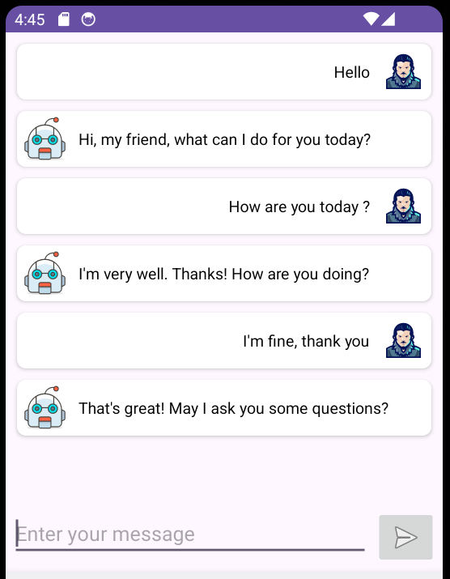

# Chat Bot App

Chat Bot is a mobile application that allows users to chat with a bot powered by the BrainShop API. The app displays messages in a chat-like interface, distinguishing between user messages and bot responses.

## Features

- Chat with a bot in real-time.
- View messages in a chat-like interface with user and bot message styles.

## Technologies Used

- Java
- Retrofit (for API calls)
- RecyclerView (for displaying messages)
- CardView (for styling messages)

## Installation

1. Clone the repository:

   ```bash
   git clone https://github.com/anaserrami/ChatBot-Mobile-App.git
    ```
2. Open the project in Android Studio.
3. Build and run the project on an Android emulator or device.

## Usage
1. Enter your message in the text input field at the bottom of the screen.
2. Tap the send button to send your message to the bot.
3. View the bot's response in the chat interface.

## Screenshots

**- Chat with a bot in real-time :**

